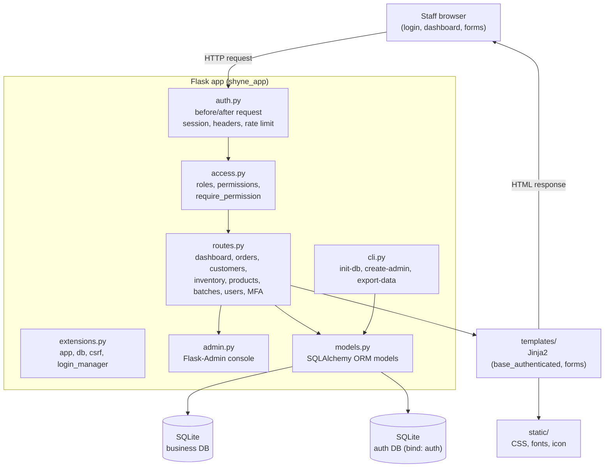
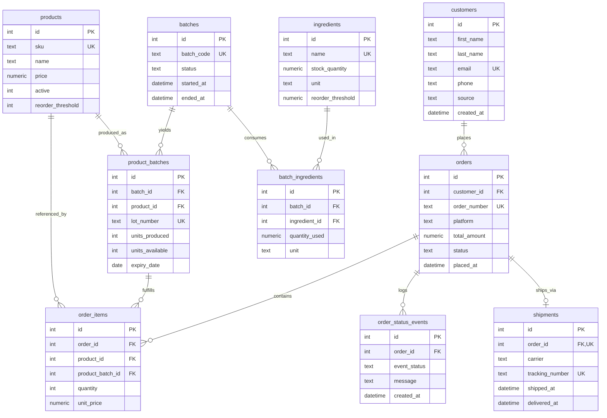
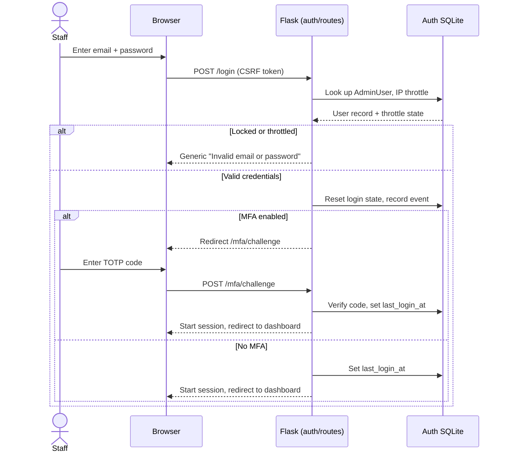
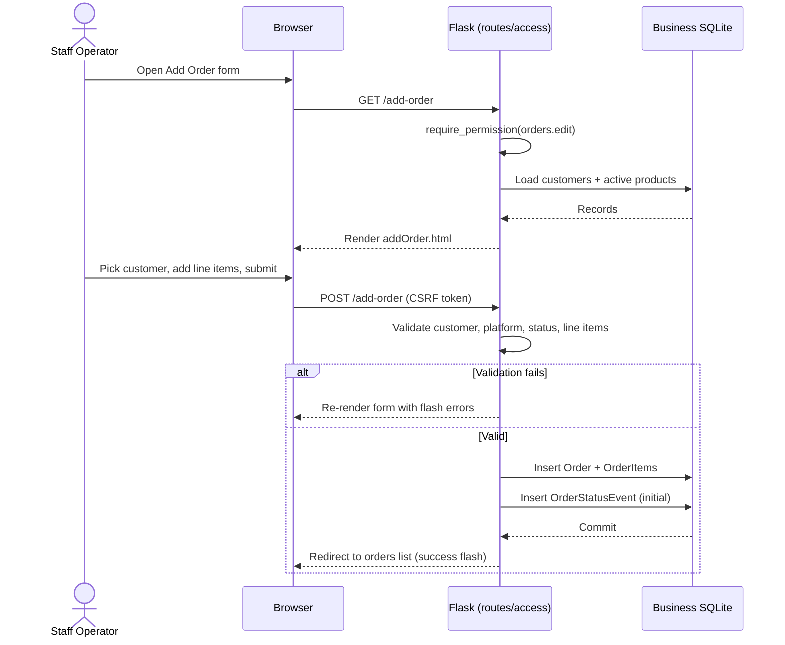

# ShyneBeauty


Flask app for the internal operations of a small skincare business. Staff use it to manage customers, orders, inventory, batches, shipments, and order status from one admin surface backed by SQLite.

This is a Kent State University Capstone project (Spring 2026). See the [project Wiki](https://github.com/BrandonRobare/ShyneBeauty/wiki) for architecture notes, the data model, and contributor history.

## Architecture

The app is a single Flask instance built in the `shyne_app/` package. `extensions.py` creates the shared `app`, SQLAlchemy `db`, CSRF, and login manager; the feature modules (`auth`, `access`, `routes`, `admin`, `cli`) register request hooks, the role and permission layer, and the page handlers against that instance. Data access runs through SQLAlchemy ORM models in `models.py`, which write to two SQLite files: one for business records and a second bound database for staff accounts and the access audit trail. Jinja2 templates in `templates/` render the staff UI and pull assets from `static/`.



## Data Model

The business schema lives in `schema.sql` and is mirrored by the ORM models in `shyne_app/models.py`. A customer places orders; each order carries line items, a status history, and an optional shipment. Products are made in batches, and each batch consumes ingredients and yields product lots (`product_batches`) that order line items can draw from. Staff accounts and the access audit log sit in a separate auth database and are not shown below.



Foreign keys enforce the business rules: deleting an order cascades to its items, status events, and shipment, while a product or customer with history cannot be deleted outright (`ON DELETE RESTRICT`). An order item keeps its row if the source lot is removed, since `product_batch_id` is set to `NULL` on delete.

## Requirements

- Python 3.10 or 3.12 (CI runs both)
- SQLite (bundled with Python)
- Gunicorn for production; the dev server covers local work

## Quick start (dev)

```bash
python -m venv .venv
source .venv/Scripts/activate   # PowerShell: .\.venv\Scripts\Activate.ps1
pip install -r requirements.txt
export SECRET_KEY="replace-with-a-local-secret"
flask --app shyne.py init-db
python shyne.py
```

Open `http://localhost:8000/login`. Unset runtime means demo mode (`APP_RUNTIME=demo-dev`); `init-db` reseeds demo data on every run.

## Demo accounts

`flask --app shyne.py init-db` seeds four deterministic users:

| Email | Password | Role |

| `superadmin@demo.com` | `demo` | Superadmin |
| `staffoperator@demo.com` | `demo` | Staff Operator |
| `inventoryproduction@demo.com` | `demo` | Inventory / Production |
| `devadmin@demo.com` | `demo` | Dev Admin |

Use them for local demo and development only. `Dev Admin` stays hidden from the `Users & Access` table and is the one seeded role with `/admin/` access.

## Running live

For internal staff deployment, skip `init-db` and use the schema-only path:

```bash
export APP_RUNTIME=live-prod
export SECRET_KEY="non-demo-secret-from-outside-git"
flask --app shyne.py init-live-db
flask --app shyne.py create-admin --email owner@shynebeauty.com
gunicorn -w 1 --threads 4 --bind 127.0.0.1:8000 "shyne_app.app:app"
```

Live requires explicit `APP_RUNTIME=live-prod`; put gunicorn behind nginx or Caddy. `live-prod` forces `SESSION_COOKIE_SECURE=True` and rejects `FLASK_DEBUG`. A separate `create-dev-admin` command provisions a hidden Flask-Admin account:

```bash
flask --app shyne.py create-dev-admin --email tech@shynebeauty.com
```

`create-admin` and `create-dev-admin` enforce the web password policy: 12 character minimum, no email fragments, no demo fallbacks. Admin passwords hash with Werkzeug PBKDF2 (`pbkdf2:sha256:1000000`). MFA is opt-in and users manage it from `/account/settings`.

## Environment variables

| Variable | Default | Purpose |

| `SECRET_KEY` | required | Flask session signing |
| `APP_RUNTIME` | `demo-dev` | `demo-dev` or `live-prod` |
| `DATABASE_URL` | see below | Business DB override |
| `AUTH_DATABASE_URL` | see below | Auth DB override |
| `SHYNE_LOG_DIR` | `instance/logs` | Log directory |
| `DISABLE_FILE_LOGGING` | `false` | Turn off the rotating file logger |
| `SESSION_COOKIE_SECURE` | runtime-dependent | Force only when behind HTTPS |
| `TRUST_PROXY_HEADERS` | `false` | Set `true` only behind a trusted proxy |
| `FLASK_DEBUG` | `false` | Dev only; blocked under `live-prod` |

With `DATABASE_URL` and `AUTH_DATABASE_URL` unset, the runtime picks SQLite files under `instance/`:

- `demo-dev` → `instance/shynebeauty_demo.db`, `instance/shynebeauty_demo_auth.db`
- `live-prod` → `instance/shynebeauty_live.db`, `instance/shynebeauty_live_auth.db`

The runtime also loads `.env`, `.env/local.env`, or `.env/.env` at import time.

## Testing

Install dev dependencies once for the Playwright accessibility suite:

```bash
pip install -r requirements-dev.txt
```

Run the standard suite:

```bash
python -m pytest -q
```

The `a11y_smoke` marker gates browser-only checks. Run those on their own once Playwright Chromium is installed:

```bash
python -m pytest -q tests/test_accessibility_smoke.py
```

## CI and security

- `.github/workflows/pytest.yml` runs pytest on Python 3.10 and 3.12, plus a Chromium a11y-smoke job.
- `.github/workflows/codeql.yml` runs CodeQL security analysis.
- `.github/workflows/dependency-review.yml` blocks PRs that pull in high-severity vulnerable deps.
- `.github/workflows/gitleaks.yml` scans pushes and PRs for committed secrets.
- `.github/dependabot.yml` schedules weekly `pip` and Actions updates.

## Backup

`flask --app shyne.py export-data` creates a timestamped `.tar.gz` of both database files and writes a SHA-256 hash file. For a manual copy, stop the app first.

- Business file: `instance/shynebeauty_<runtime>.db` (or wherever `DATABASE_URL` points).
- Auth file: `instance/shynebeauty_<runtime>_auth.db` (or wherever `AUTH_DATABASE_URL` points).
- Back up both files together; they split business and auth data.
- Stop the app before copying or restoring files.
- Keep a pre-restore snapshot so you can roll back if a restore fails.

## Repository layout

- `shyne.py`: 8-line entrypoint that exposes `shyne_app.app:app` and runs the dev server.
- `shyne_app/`: the package: `app`, `config`, `extensions`, `models`, `auth`, `access`, `routes`, `admin`, `cli`, `rate_limit`.
- `templates/`: Jinja templates for the admin UI.
- `static/`: shared frontend assets
- `tests/`: pytest coverage for auth, CSRF, protected routes, create workflows, CLI, and model behavior.
- `schema.sql`: reference schema for the business tables.
- `.github/workflows/`: CI and code-scanning workflows.

## Key flows

Two diagrams trace the paths I built. The first is staff sign-in, including the IP throttle, per-account lockout, and the optional TOTP challenge. The second is order creation from the Add Order form.





## My Contributions

ShyneBeauty was a team project. The work below is what I built, alongside teammates who contributed to planning and review.

- I designed the SQLite data model in `schema.sql` and the matching SQLAlchemy models in `shyne_app/models.py`: customers, products, ingredients, batches, product lots, orders, order items, status events, and shipments, with the foreign keys and indexes that keep the records consistent.
- I built the authentication and account system on a separate auth database: password hashing with Werkzeug PBKDF2, a forced password-change flow for temporary credentials, per-account lockout, per-IP login throttling, and opt-in TOTP multi-factor auth with QR enrollment.
- I wrote the role and permission layer in `shyne_app/access.py`. Four roles (Staff Operator, Inventory / Production, Superadmin, Dev Admin) map to permission bundles, and a `require_permission` decorator gates every route. Superadmins manage staff through an invite, activate, suspend, and role-change console, with an audit event written for each action.
- I implemented the business workflows in `shyne_app/routes.py`: the dashboard, order entry with multi-line items and an initial status event, the customer database, ingredient inventory with stock thresholds, product and product-batch management with auto-generated batch codes and lot numbers, and search and filter on each list page.
- I added the security middleware in `shyne_app/auth.py`: CSRF protection, a content security policy and other response headers, safe redirect handling for `next` targets, no-store caching on sensitive pages, and session revocation when an account is suspended mid-session.
- I split the original single-file app into the `shyne_app/` package and wrote the Click CLI in `shyne_app/cli.py` for database setup, admin creation, demo seeding, and a hashed `tar.gz` backup command.
- I set up the pytest suite and the GitHub Actions CI, including the Python 3.10 and 3.12 matrix, the Playwright accessibility smoke job, and the CodeQL, dependency-review, and gitleaks scanning workflows.

## Team

ShyneBeauty was a Kent State University Capstone team project, Spring 2026. The team:

- **Brandon Robare** (data model, auth, access control, business workflows, tests, CI)
- **Melanie Waddle**
- **Bianca Amoako**
- **Peyton Fazio**
